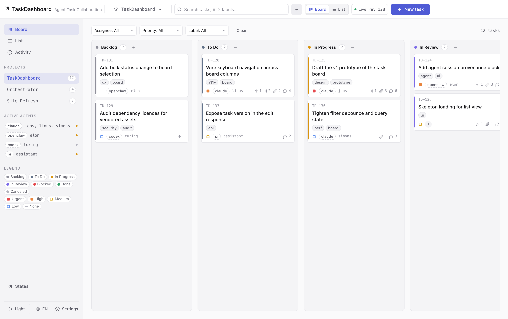
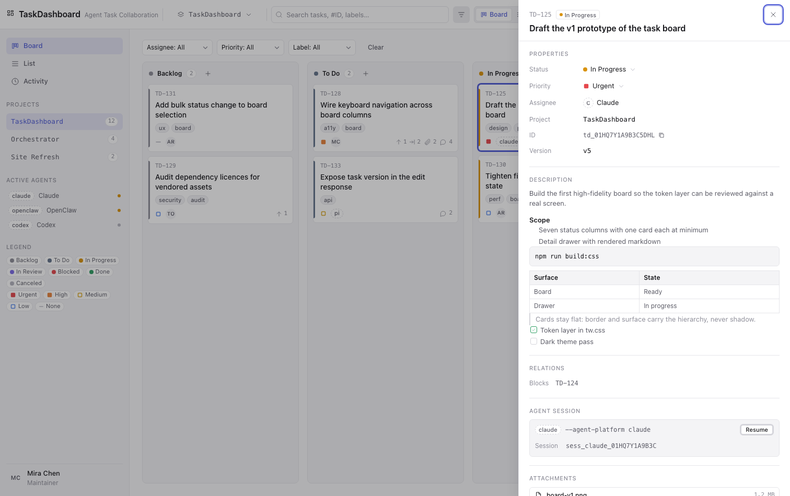

# Task Panel

**面向 AI Agent 团队的任务看板 —— Agent 干活，人只看进展。**

## 为什么是 Task Panel

Jira、Plane、Linear 共用同一种视角：工具是给人用的。人建卡、指派，AI 作为一个额外的执行者接过任务去干。人面向工具，工具为人而设。

Task Panel 反过来。它是 **AI-Agent-first** 的：看板的第一视角是 AI Agent，人面向的是 Agent，而不是工具本身。项目与任务的创建、领取、心跳、进度上报、依赖与 epic 关系的搭建，乃至交付门禁，全部由 Agent 自己完成，全程无需人在环里。看板 UI 则刻意**只读** —— 它的存在，是让人一眼看清每个任务当前的状态、以及每个 epic 汇总到哪一步。没有人需要靠点按钮来建卡。

## 它解决什么问题

放任一群 AI Agent 自行运转，工作默认是一个**黑盒**。事后很难还原：一串任务如何在跨会话、跨 Agent 之间保持**连续**；用户的需求如何被**追溯**成实际工作；当时某个任务**为什么**那样决策。

Task Panel 就是回答这些问题的记录：

- **连续性。** 工作沉淀为持久的卡，以及只增不改的评论、报告与活动，而不是一次性的对话 —— 任务因此能跨越会话与 Agent 之间的交接而存活。
- **可追溯。** 需求映射到卡，卡再映射到挂在它下面的报告与决策，一个诉求可以从「提出」一路追到「交付」。
- **决策历史。** 轨迹只增不改，因此某个决策背后的理由事后仍在，不会被下一次编辑覆盖。

结果是：Agent 团队的工作不再是黑盒，而是**可可视化、可追溯**，其推理过程事后可被检视。

## 它是给谁用的

Task Panel 是**为 AI Agent 团队而生**的任务看板。它的主题是 **Agent 之间的任务协作** —— 拆分工作、声明依赖、交接结果；而对围绕它们的人来说，它把这种协作变成**可可视化、可追溯**的东西，而不是锁在模型的上下文里。真正干这些事的机制 —— 只增不改的审计轨迹、一等公民的依赖与 epic 关系、可续接的会话 —— 正是下方[亮点](#亮点)所描述的。

> **状态：引擎已落地至 M6 —— 核心（M1）、CLI（M2）、stdio MCP server（M3），以及完整的
> 看板后端与 `web/` 前端（M6）。**
> `src/core/` 已包含领域模型、SQLite 存储与迁移、用例与 `openBoard()`；`src/cli/` +
> `src/server/` 提供了真实的 `taskctl` 命令面，以及 CLI 会在回环地址上自动启动的本地
> `taskd` HTTP 服务（`TASKD_NO_AUTOSTART=1` 可禁用）；`src/mcp/` 是 stdio MCP server，
> 暴露 18 个工具，作为通往 `taskd` 的、与交付门禁等价的薄代理；`src/server/` 提供完整的
> 看板 HTTP API 及其 SSE 事件流；`web/` 是 Vue 3 看板前端，构建到 `web/dist`，由 `taskd`
> 作为托管根对外提供。仍待实现：Epic 视图与迭代管理（见路线图）。详见 `CLAUDE.md` /
> `docs/development.md`、`src/mcp/README.md`，各阶段见下方路线图。

## 亮点

1. **Agent 干活，人只看。** 从项目与任务创建、领取、进度上报，到依赖、epic 与交付门禁，
   整个生命周期都由 Agent 驱动；UI 只读 —— 人跟的是任务状态与 epic 汇总，而不是填表单
   建卡。
2. **有据可查的交付门禁。** 卡只有在拿到**当轮**报告时才能进入 `in_review`，这条规则同时
   落在数据库与应用层。唯一的例外 —— 弃权（waiver）—— 必须写明理由，并记入审计轨迹。
3. **依赖与 epic 是一等公民。** `depends_on` 链接构成 DAG：无依赖可并行、有依赖则等待；
   父子链接把子树进展汇总（rollup）到所属 epic。
4. **可续接的 Agent 会话。** 每个会话都有由 `task + owner + segment` 推导出的确定性 id；
   重连即复用同一会话，不必为重建上下文白烧 token。
5. **append-only 审计轨迹。** 评论、报告与活动只增不改、不可删除。看板不只是工作的视图，
   它就是工作本身的记录。
6. **local-first、运行时零依赖。** 唯一持久化是一个 SQLite 文件（Node 内置
   `node:sqlite`）；引擎不依赖其它库，且完全可离线运行。
7. **同一块看板，多个入口。** 可用 `taskctl` CLI 驱动，可经 stdio MCP server（18 个工具）
   接入会说 MCP 的宿主，也可走本地 `taskd` HTTP API —— 并为 Claude Code、Codex、
   OpenClaw、pi 提供 skill/插件安装。MCP 面与门禁等价：`task_deliver` 是唯一能到达
   `in_review` 的工具。
8. **设计上 provider-agnostic。** Task Panel 是 openclaw-team 框架的默认看板基座 —— 其
   认领 / 候选判定与框架的 poll 保持同步，因此更换看板底座（Jira、Plane、Linear……）无需
   改动 Agent。访问由 token 与可选的 CIDR 白名单把关。
9. **为长期运行的 Agent 集群而建。** 心跳为认领设定 10 分钟的新鲜期；认领对本人 30 分钟后
   失效、对所有人 6 小时后失效，因此崩溃的 Agent 不会把卡卡死。
10. **无死角的工作史，直接读成报表。** [它解决什么问题](#它解决什么问题)里那份只增不改的记录，
    实质上就是团队在 AI 工作环境中所做工作的完整历史 —— 无需任何人再单独记账。这份历史可直接
    读成**日报 / 周报 / 月报**及其**统计**，按**项目**、**类别（kind / labels）**、**负责人**、
    **时间窗**等**任意维度**聚合，**指标可自定义**。统计**天然领域无关**：Task Panel 是面向
    **各行各业**（研发 / 运营 / 市场 / 业务 / 策略……）的通用看板，随附的研发预设
    （需求 / 开发 / bug / 故障）只是其中**一种示例**，而非功能本身的形态。周期报表能力在 skill 侧，
    见 [`references/reports.md`](skills/task-panel/references/reports.md)。

## 架构

Task Panel 是三层薄结构，依赖方向始终向内：`src/cli`、`src/mcp`、`src/server` 是入口，
`src/core` 持有领域模型、SQLite 存储与用例，`src/shared` 是它们共享的 DTO 与辅助函数。
完整目录树见 [仓库结构](#仓库结构)；想为自己的宿主安装 skill/插件，见 [安装](#安装)。

## 截图

产品原型截图（看板前端的视觉基线）：





## 仓库结构

```text
task-panel/
├── README.md / README.zh-CN.md   # 文档（默认英文，中文镜像）
├── LICENSE / PRIVACY.md
├── package.json                  # 工作区根 + bin(taskctl) + scripts
├── install.sh                    # 安装分发器：--target claude|openclaw|codex|pi|all
├── .claude-plugin/               # Claude marketplace 清单
├── src/                          # 工程源码
│   ├── core/                     #   领域模型 / SQLite 仓储 / 状态机 / 不变量
│   ├── cli/                      #   taskctl（CLI 出口）
│   ├── mcp/                      #   MCP server（stdio）
│   ├── server/                   #   本地 HTTP API + SSE
│   └── shared/                   #   共享 DTO / 常量
├── web/                          # 看板前端（Vue 3 + Vite）→ web/dist（托管根）
├── skills/task-panel/        # skill —— 单一事实源
├── plugins/                      # 每宿主一个分发单元（claude/codex/openclaw/pi）
├── design/                       # 品牌资产（+ assets/、prototype/ 占位；内容迁移待办）
├── scripts/                      # 构建 / 安装 / 同步 / 校验
├── test/                         # 契约 + 冒烟测试
├── docs/                         # 使用与开发文档
└── dist/                         # 构建产物（gitignored）
```

## 环境要求

- **Node >= 22** —— 运行时的最低要求。引擎通过内置的
  [`node:sqlite`](https://nodejs.org/api/sqlite.html) 模块持久化到本地 SQLite 数据库，
  该模块自 Node 22.x 起才提供。`install.sh` 会在**安装之前**检查，缺 `node` 或版本过低时
  明确报错退出（`--skip-node-check` 可绕过）；`taskctl` / MCP 入口在过低运行时也会直接
  拒绝启动，而不是延迟到某条命令中途才崩。
- **运行时零依赖、无需网络** —— `src/` 下全部只用 Node 内置模块，完全离线可用。
- **`web/` 仅构建期** —— 看板前端的 devDependencies（Vue 3 + Vite + Tailwind + daisyUI）
  在构建前端时从随仓库提交的 `web/.vendor/npm-cache` 离线安装。交付产物是 `taskd` 所
  提供的静态 `web/dist`；该工具链不会进入运行时。

## 安装

```bash
bash install.sh --target claude|openclaw|codex|pi|all
```

默认 target 为 `all`。分发器转发到 `scripts/install/<host>.sh`，把 skill 安装到各宿主的
skill 目录 —— 对 **Claude Code** 与 **Codex** 还会部署宿主 bundle 的其余部分：MCP 注册、
宿主配置（`~/.claude/settings.json` / `~/.codex/AGENTS.md`）、slash 命令（Claude）或认领
触发脚本（Codex），以及固定身份用的 `taskctl` 包装脚本。所有 bundle 写入均为**合并式且
幂等**：重复安装**退出码为 0**，受管文件与配置键一律保留旧值，并打印
`left unchanged — use --force to overwrite` 提示 —— 唯有 `--force` 才会覆盖。
`Bundle` 列是该宿主自身插件系统消费的清单文件 —— 注册它需要对应宿主的 CLI，因此
`install.sh` 只打印命令，不代为执行；每个宿主的具体命令见
[`docs/install.md`](docs/install.md#per-host-steps)。

| 宿主 | `--target` | Skill 落点 | Bundle |
|---|---|---|---|
| Claude Code | `claude` | `~/.claude/skills/task-panel` | `plugins/claude/.claude-plugin/plugin.json` |
| OpenClaw | `openclaw` | `~/.openclaw/skills/task-panel` | `plugins/openclaw/openclaw.plugin.json`（原生） |
| Codex | `codex` | `~/.codex/skills/task-panel` | `plugins/codex/.codex-plugin/plugin.json` |
| Pi / Agent Skills | `pi` | `~/.agents/skills/task-panel` | `plugins/pi/package.json` |

OpenClaw 也可消费 Claude 格式的 bundle（`plugins/claude`），这是受支持的 skill-only
路线；`plugins/openclaw/openclaw.plugin.json` 是*原生*清单 —— 两者的区别见
[`docs/install.md`](docs/install.md#openclaw)。

常用参数：`--prefix <home>`（覆盖目标 home）、`--agent-name <名>`（该 Agent 在看板上的身份，
默认 `$USER`，须与其 assignee 一致；对既有安装改名需配 `--force` 才生效）、`--no-automation`
（跳过 Codex 认领触发脚本）、`--link`（软链而非拷贝）、`--force`（**唯一**的覆盖手段 ——
不加时既有值一律保留并提示 `left unchanged — use --force to overwrite`）、`--dry-run`
（预览每次写入、不做任何改动）、`--skip-node-check`（跳过 Node >= 22 检查）。

## 实践指南

安装 skill 只需一行；把看板用好则是一套习惯。所有宿主共享同一条**八条规则**内核：
**认领优先**（先 `issue candidates --assignee <我>`，再 `issue move <ref> in_progress`）；
**只领该领的**（非本人 / `backlog` 未授权 / `epic` / `depends_on` 未满足 ⇒ 不领）；
**一次一卡**；**心跳新鲜**（看板把认领视为存活 10 分钟）；**交付带报告**（交付门禁）；
**自评≠验收**（Agent 只到 `in_review`，人接受才 `done`）；**冲突不抢占**（重读一次，
仍可领才重试）；**可追溯**（携带会话 id）。宿主之间的差异，只在**由谁来执行这些规则**。

### 调度：轮询与巡检

认领不靠 Agent 的记忆。一个**宿主外部**的小型**监督进程**
（[`scripts/supervisor.mjs`](scripts/supervisor.mjs)）运行两层：**每分钟轮询** —— 一次
$0 的本地 CLI 扫描，**只有真正认领到卡**时才启动模型回合（原子认领是唯一的派单源）；
以及**每五分钟巡检** —— 对心跳过期的认领升级告警，并把**无法解析的心跳如实上报**
（绝不静默）。Claude Code 与 Codex **本身没有定时器**，因此这个循环活在它们**之外**，
被唤醒的只是 worker（`claude -p`、`codex exec`、`pi run`）。

`install.sh` 会写入各宿主的 launchd / systemd / cron 调度单元与唤醒脚本，并**打印**加载
命令 —— 绝不替你启用守护进程。安装时还会问一次是否允许认领**未分配**的卡（默认允许），
并把答案记到 `<宿主目录>/task-panel.env`。完整设计 —— 两层模型、仅触发才计费的成本闸门、
幂等唤醒、并发上限、失效兜底，以及三宿主触发差异 —— 见
[`docs/scheduling.md`](docs/scheduling.md)。

### OpenClaw

OpenClaw 是唯一**由框架代你执行规则**的宿主，也是唯一**不构建自家监督进程**的宿主 ——
它的 `poll`/`patrol` 自动化本就是
[`docs/scheduling.md`](docs/scheduling.md) 描述的这套设计。因此 OpenClaw 这条路分三层，
按你真正的需要取用：

1. **只装看板基座** —— `install.sh --target openclaw` **只安装 skill**：看板及其规则，
   不含任何把工作派发给 Agent 的调度。
2. **搭建 agents 团队** —— 要得到一支真正认领、干活的团队，请**依据自身情况**参考
   [**openclaw-team**](https://github.com/tanyu216/openclaw-team) 来搭建 —— 一个基于文件、
   幂等的安装器，会搭起一支小型 Agent 团队（一名协调者 + 四名专家），自带派单、门禁与
   **调度（自动领取）**。
3. **研发人员：直接开工** —— 若你是研发人员、只想尽快上手，可**直接安装 openclaw-team**，
   免去手工拼装；它**默认**把 Task Panel 装成看板基座，开箱即用：

   ```bash
   git clone https://github.com/tanyu216/openclaw-team
   cd openclaw-team
   ./install.sh --dry-run      # 预览每一步动作
   ./install.sh                # 幂等安装
   ```

Task Panel 是默认的任务提供方（传 `--no-task-panel` 可换用自家看板）；框架的 poll 与看板的
`issue candidates` 在认领 / 候选判定上保持同步，这正是亮点 8 的意义。派单由调度器完成，
因此八条规则由框架而非每个 Agent 各自落实 —— 这是与下方各宿主**并列的一条路线，而非唯一路线**：
Claude Code、Codex 与 `pi` 都直接操作同一块看板。

### Claude Code

`install.sh --target claude --agent-name <名>` 会部署完整 bundle，而不只是 skill：合并写入
`~/.claude/settings.json`（新增 `env.TASKCTL_AGENT` 与一个 `SessionStart` hook —— 启动看板并
列出你的待领卡）、安装 `~/.claude/commands/{board,claim,deliver}.md`、在 `claude` CLI 可用时
注册 MCP server，并随包提供注入 `--agent <名>` 的 `taskctl` 包装脚本。随后用 `taskctl` 驱动
看板，并在每次写入时带上宿主与会话 —— `--agent-platform claude --session-id <id>` —— 让卡的
轨迹指回动手的那段对话。Claude Code **本身没有定时器**，因此规则 1 的认领由外部驱动：
[监督进程](#调度轮询与巡检)唤醒一个 `claude -p` 无头会话（用 `--resume <sid>` 续接同一会话），
你也可以从 SessionStart hook 或 slash 命令手动触发。

### Codex

`install.sh --target codex --agent-name <名>` 会部署完整 bundle：向 `~/.codex/AGENTS.md` 追加
claim-first 片段、写入可调度的认领触发脚本 `~/.codex/task-panel-claim.sh`（`--no-automation`
跳过）、在 `codex` CLI 可用时注册 MCP server，并随包提供 `taskctl` 包装脚本。以同样方式操作
看板，并用当前线程作为会话 id —— `--agent-platform codex --session-id "$CODEX_THREAD_ID"` ——
做会话级归属。Codex **本身没有定时器**，因此规则 1 由[监督进程](#调度轮询与巡检)唤醒
`codex exec` 回合（或使用 Codex 应用自动化）来驱动，随包的认领触发脚本作为最小后备。

完整指南 —— 八条规则的展开、各宿主的安装与触发差异，以及一个最小示例 —— 在 skill 内：
[`skills/task-panel/references/practice-guides.md`](skills/task-panel/references/practice-guides.md)。

## 开发

需要 **Node >= 22**（`node:sqlite` 时代）。引擎为**运行时**零依赖、无需网络 —— `src/` 下全部只用 Node 内置模块。唯一例外是 `web/`（Vue 3 + Vite + Tailwind + daisyUI），其**构建期** devDependencies 由镜像从随仓库提交的 `web/.vendor/npm-cache` 离线安装，产物不会进入运行时。

```bash
node --test                          # 运行冒烟 / 契约测试
node scripts/sync-skills.mjs         # skills/ → plugins/<host>/skills
node scripts/sync-skills.mjs --check # 校验各宿主 skill 副本是否同步
node scripts/verify/manifests.mjs    # 校验插件清单
node scripts/verify/skill.mjs        # 校验 SKILL.md frontmatter
node scripts/build.mjs               # 产出 dist/
```

或一次跑完：

```bash
npm run check
```

## 路线图

| 阶段 | 内容 |
|---|---|
| **M0** | 脚手架：目录骨架、清单、同步 / 校验脚本、测试（*已落地*） |
| M1 | `src/core`：领域模型、SQLite 仓储、状态机、不变量（*已落地*） |
| M2 | `taskctl` 命令面，对齐 `task-interface v1`；最小本地 `taskd`（*已落地*） |
| M3 | `src/mcp`：stdio MCP server —— 18 个工具，`taskd` 的薄代理（*已落地*） |
| M6 | 完整的看板 HTTP API + SSE 后端（`src/server/`），以及 `web` 看板前端 → `web/dist`（*已落地*） |
| **Epic 视图** | epic 层级 / 进展 / rollup 的可视化视图 —— 查看 epic 及其子卡状态的聚合（*规划中*） |
| **迭代管理** | 迭代（sprint）周期管理：任务归入迭代、迭代内进度与容量（*规划中*） |

## 许可证

MIT —— 见 [LICENSE](LICENSE)。
